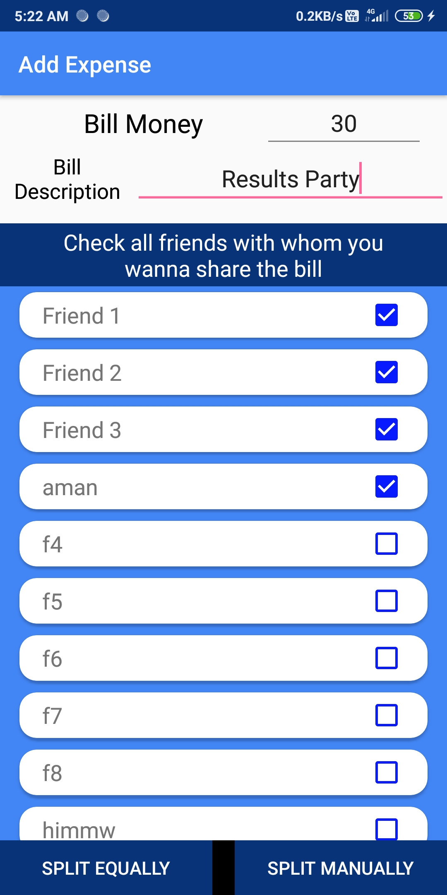
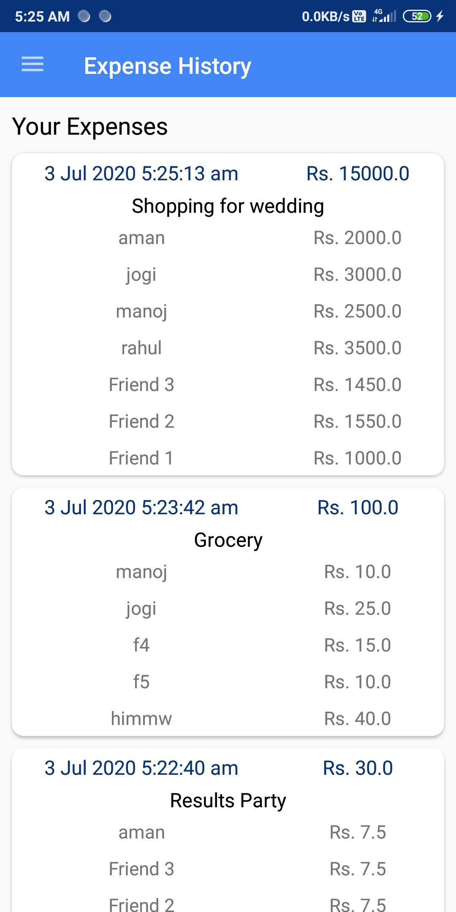
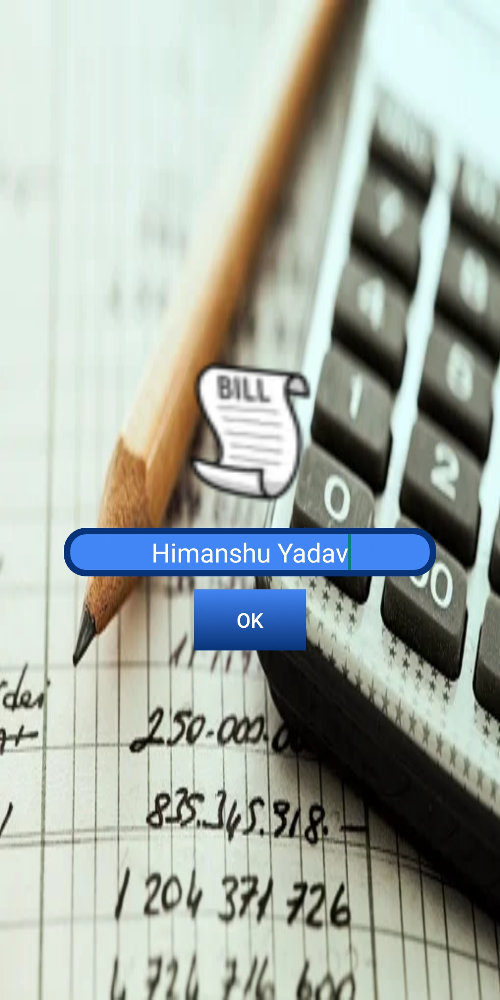

# Bill Split App
An app that keeps record of all the expenses and splits them between your friends.

- Technical Features:
  - Kotlin
  - Maths functionality for splitting bill
  - Either split equally or unequally
  
## Hello,
This app was created by me under 30 Days of Kotlin campaign by Google Developers India. It was surely a nice experience & we had to submit a Kotlin program/app as the final project for which I made this small app.

## Snapshots:
  
